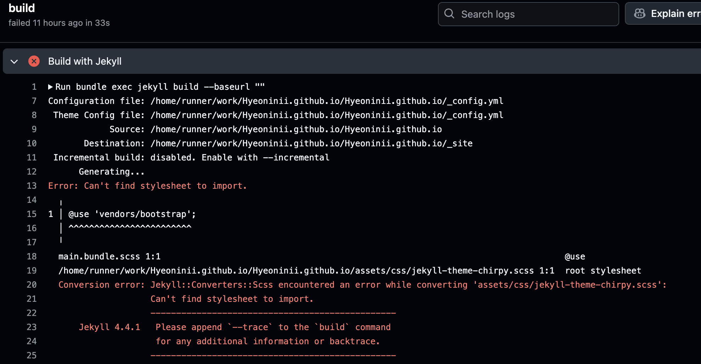
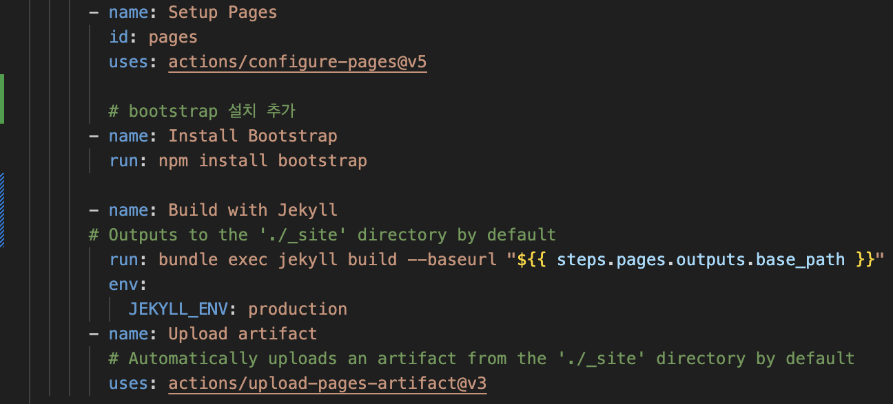
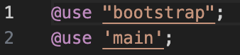
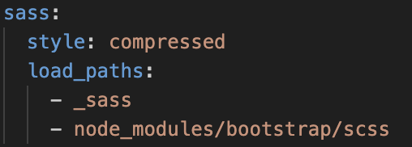
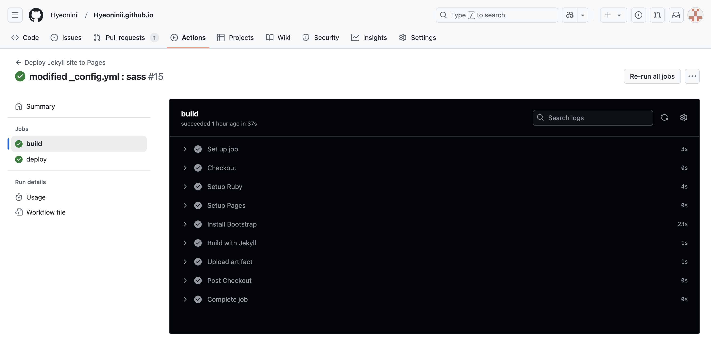
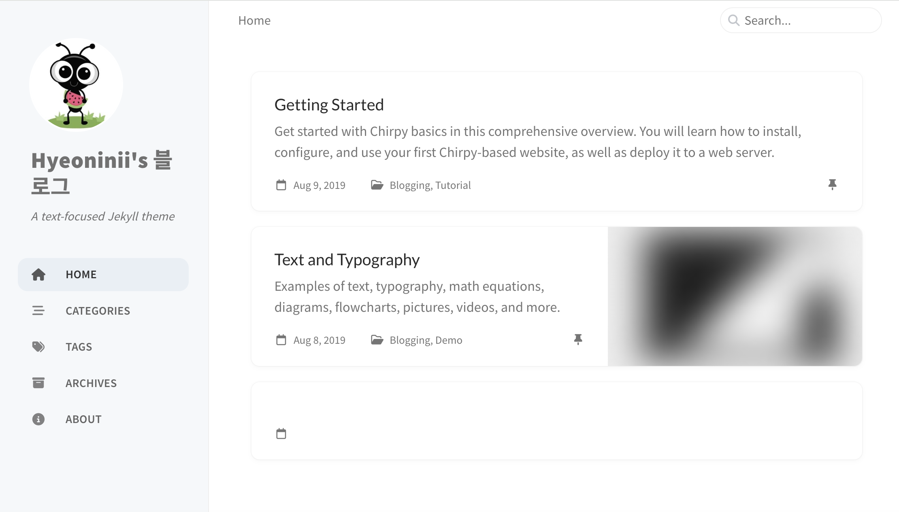

MARCH 11, 2025
[Hyeoninii](https://github.com/Hyeoninii)


## 블로그 만들다가 생긴 문제

Chirpy 테마 적용하다가 GitHub Actions에서 오류가 터졌다.
로그를 보니까 vendors/bootstrap 파일을 못 찾아서 테마가 적용이 안 되는 문제였다.



오류 내용을 보니 `vendors/bootstrap` 파일을 찾을 수 없다는 메시지였다.  
부트스트랩은 웹사이트의 디자인을 쉽게 구현할 수 있게 해주는 프레임워크인데,  
GitHub Workflow에서 `jekyll.yml`을 설정할 때 부트스트랩 참조가 제대로 되지 않아서 생긴 문제였다.  

처음 시도한 방법은 `@use 'vendors/bootstrap';`을 삭제하는 것이었다.  
이렇게 하면 빌드는 정상적으로 됐지만, 블로그 레이아웃이 깨지는 문제가 발생했다.  
결국 해결 방법은 **GitHub Actions에서 부트스트랩을 직접 설치하는 것**이었다.

## 해결 방법

이 문제를 해결하려면 아래 세 개의 파일을 수정해야 한다.

- `.github/workflows/jekyll.yml`
- `_sass/main.bundle.scss`
- `_config.yml` 


### 1️⃣ `jekyll.yml` 수정하기  

GitHub Actions에서 `Build with Jekyll` 작업 전에 부트스트랩을 설치하도록 수정해야 한다.  
기존에는 부트스트랩이 자동으로 포함될 거라고 생각했는데, 그렇지 않아서 수동으로 추가했다.  

아래와 같이 `npm install bootstrap`을 실행하도록 설정을 변경했다.  

```yaml
- name: Install Bootstrap
  run: npm install bootstrap



Build with Jekyll 작업이 실행되기 전에 npm install 부트스트랩으로 먼저 부트스트랩을 설치해주었다.

부트스트랩은 node_modules 부트스트랩/scss … 아래 설치가 되는데 _config.yml파일에서 main.bundle.scss가 경로를 참조할 수 있도록 설정을 수정해주어야 한다.



다음과 같이 수정하였다. 

main.bundle.scss 파일에서는 vendors 부트스트랩 을 부트스트랩으로 번경한다.



## 결과 확인

이제 GitHub Actions에서 빌드를 실행하면 정상적으로 완료된다.



그리고 블로그 레이아웃도 제대로 적용되었다.



