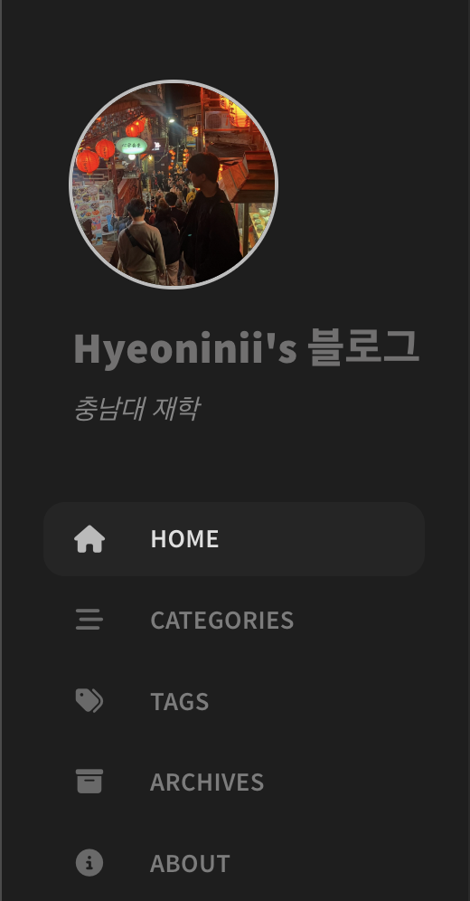
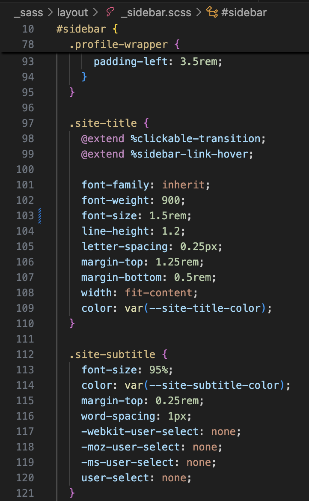

Actions 오류를 해결한 후에 새로운 문제가 생겼다.

**블로그에 사진이 표시되지 않는다!!**
 

사진을 `_post` 하위 폴더에 저장해서 발생한 문제였다. 

 

### 1. 사진 경로 설정
사진이 정상적으로 표시되려면 사진을 `assets/img` 하위에 저장해야한다. 그래서 `assets/img` 폴더 안에 `post_imgae` 폴더를 추가하고, 날짜별로 정리했다. 

> **📌reference**  
> Markdown에서는 **``** 형식으로 이미지를 업로드한다.  
예를 들어, ``처럼 작성하면 된다.
만약 사진 크기를 조절하려면 `img 태그`를 사용해야 한다.  
**예시:** ``

✅ **수정된 사진**

---

### 2. `_config.yml` 파일 수정
`_config.yml` 파일에서 `cdn`관련 설정을 주석 처리했다.

---

### 3. 프로필 사진 수정
프로필 사진도 마찬가지로 `/assets/img` 폴더 하위에 저장해야 한다.  
또한 `config.yml` 파일에서 `avatar`속성을 해당 이미지 링크로 수정해야 한다.

✅ **프로필 사진**
 
  

         

**사진 관련 오류도 처리 완료~!**

   

## +추가
사이드바에서 프로필 사진 밑에 글자 폰트가 너무 커서 `css`파일을 수정해주었다. 
`.site-title`의 `font-size`값을 `1.75 → 1.5`로 변경해주었다.  

 

  
  

