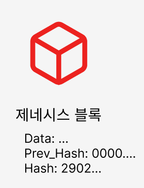

# 블록체인의 탄생
> 블록체인이란?  
> **지속적으로 증가하는 데이터를 암호학을 통해 보호하고 연결하는 기술**

블록체인이라는 개념은 1991년, Stuart Haber와 W. Scott Stornetta가 발표한 논문  
**“How to Time-Stamp a Digital Document”** 에서 처음 소개되었다.

이 논문은 디지털 문서의 변조를 막기 위해 타임스탬프와 암호 기술을 활용하는 방법을 제시하며, 이후 블록체인의 기술적 기반이 되었다.

  

# 블록이란?

블록이란 블록체인에서 데이터를 저장하는 단위로써 세 가지 주요 정보를 가진다.

> **Data**: 블록에 담긴 데이터  
> **Prev.Hash**: 이전 블록의 해시 값  
> **Hash**: 현재 블록의 고유 해시 값

 

각 블록은 **데이터**와 **이전 해시 값을 바탕으로** 자신만의 해시 값을 생성하며, 이 값은 64자리의 16진수 문자열이다.

 

## 제네시스 블록

  <!-- 왼쪽: 텍스트 영역 -->
  

    

      블록체인에서 가장 처음에 생성되는 블록을 <strong>제네시스 블록</strong>이라고 한다. 
      제네시스 블록은 블록체인의 시작점으로, <strong>절대 변경되지 않으며</strong> 그 순서도 바뀌지 않는다. 
      또한 이전 블록이 존재하지 않기 때문에 <code>Prev.Hash</code> 값이 없다.
    

  

  <!-- 오른쪽: 이미지 영역 -->
  

    
  

 

> <strong>제네시스 블록:</strong> 블록체인의 첫 번째 블록으로, 절대 바뀌지 않는다.

  

# 블록체인이란?

블록 체인이라 불리는 이유는 제네시스 블록부터 시작해서 모든 블록들이 ***해시 값을 통해서 암호학적으로 연결되어 있기 때문***이다.

제네시스 블록 뒤에 블록이 생성되면 해당 블록은 다음의 정보를 가진다.

> Data: 블록 고유의 데이터  
> Prev.Hash: 제네시스 블록의 해시값  
> Hash: Data와 Prev.Hash 값을 기반으로 해시 함수를 통해 생성된 블록의 고유 해시 값

 

 

**암호학적으로 연결되어 있다**는 의미는 이후에 생성되는 블록은
1. 바로 이전에 있던 블록의 해시 데이터를 갖고 있으며
2. 그 값(Prev.Hash)을 바탕으로 자신의 해시 값을 생성하기 때문에  

결과적으로 모든 블록이 암호학적으로 연결된 구조가 된다.

만약 블록의 해시 값이 바뀌면 → 다음 블록에서 참조하는 Prev.Hash 값이랑 일치하지 않게 되고 → 체인이 유효하지 않게 된다.

  

## 왜 해시 값을 사용하는가?

블록체인에서 사용하는 해시 값은 사람의 지문과 같다.  
사람마다 지문이 다르듯, 해시 값도 각 데이터마다 고유하게 생성되어 데이터를 식별하는 역할을 한다.
이처럼 디지털 문서의 무결성과 진위를 확인하기 위해 해시 함수가 사용된다.  
대표적인 해시 알고리즘으로는 SHA-1, SHA-256 등이 있으며, 이들은 모두 오픈소스로 공개되어 있다.  

블록체인에서는 SHA-256이 주로 사용된다.
- SHA는 Secure Hash Algorithm의 약자이다.  
- 256은 출력되는 해시 값의 <strong>비트 수(256비트)</strong>를 의미한다.

그래서 SHA-256의 해시 값은 항상 256비트 길이이며, 이를 16진수로 표현하면 총 64자리가 된다.
> 256비트 ÷ 4비트(16진수 한 자리당) = 64자리  

[해시함수 예시](https://tools.superdatascience.com/blockchain/hash/)

 

## 해시 함수 특징

해시 함수는 다음과 같은 중요한 특징을 가진다. 
1.	단방향성 (One-Way): 해시 값을 통해 원래 데이터를 복원할 수 없다.
2.	결정성 (Deterministic): 동일한 입력에는 항상 동일한 해시 값을 출력한다.
3.	빠른 계산 속도: 입력이 크더라도 빠르게 해시 값을 계산할 수 있다.
4.	쇄도 효과 (Avalanche Effect): 입력 데이터가 조금만 바뀌어도 전혀 다른 해시 값이 생성된다.
5.	충돌 저항성: 서로 다른 두 입력이 같은 해시 값을 가질 가능성이 매우 낮다.

따라서 해시 값은 블록체인 내 데이터의 ***무결성을 검증***하고, ***블록 간 연결의 안전성을 확보***하는 데 핵심적인 역할을 한다.