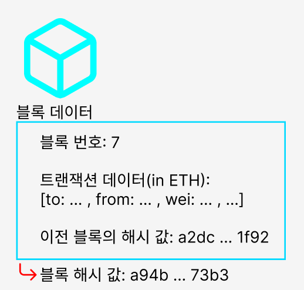

## 개요

  <!-- 왼쪽: 텍스트 영역 -->
  

    

하나의 블록은 <em>블록번호, 트랜잭션 데이터, 이전 블록의 해시 값, 현재 블록의 해시 값</em>으로 구성된다. 

  

그리고 <strong><em>블록의 해시 값</em></strong>은 <em>블록 번호, 데이터, 이전 블록의 해시 값</em>을 기반으로 생성된다. 이것은 무척 단순한 작업이다.

 

  

  <!-- 오른쪽: 이미지 영역 -->
  

        
  

 

현재까지 배운 바로는 해시 알고리즘으로 암호학적으로 연결한 블록체인을 한 네트워크 안에서 모든 피어가 공유를 하는 분산 P2P방식을 사용하여 탈중앙성과 신뢰성을 확보한다고 생각을 한다.

그러나 이 방식에는 허점이 있는데 블록의 해시를 쉽게 만들 수 있다는 것이다.  
누구나 블록을 쉽게 만들 수 있다면 공격자가 원하는 블록을 체인에 연결하는 것이 쉽다는 말, 즉 체인을 쉽게 조작할 수 있는 상태이다.

> 여기서 체인을 조작할 수 있다는 의미는 추후에 더 깊게 다뤄야 함
> 

---

## 채굴이란?

블록의 해시 값을 특정 범위 내로 변경하는 작업

## 그렇다면 블록의 해시 값을 어떻게 바꿀 수 있을까?

해시 값을 변경하기 위해서는 블록의 데이터가 변경되어야 한다. 그러나 블록이 가지고 있는 값들을 살펴보면 임의로 변경할 수 있는 값은 존재하지 않는다.

블록 체인은 블록이 순서대로 연결되는 것이기 때문에 블록 번호를 변경할 수 없다.

트랜잭션 데이터를 변경한다는 것은 거래 내용을 변경하는 것이기 때문에 블록체인의 신뢰 자체가 깨지게 된다.

이전 블록의 해시값은 암호학적으로 연결된 것을 나타내기 때문에 당연히 변경할 수 없다.

그래서 블록체인에서는 **논스(nonce)** 라는 임의의 값을 추가하여 해시 값을 조정할 수 있게 했다. 논스는 블록 내에서 유일하게 마음대로 바꿀 수 있는 값이며, 주로 채굴 과정에서 사용된다.

  

### "특정 범위 내"로 들어온다는 것은 무슨 의미일까?

블록체인에서는 해시 알고리즘을 사용하여 블록들을 암호학적으로 연결한다. 주로 사용되는 알고리즘은 SHA-256이고,  SHA-256은 256비트 해시 알고리즘으로, 해시 값의 범위는 0부터 2²⁵⁶-1까지이다. 이는 약 **1.16 × 10⁷⁷** 개의 서로 다른 값이 가능하다는 뜻이다. 해시 알고리즘의 바운더리는 유한하다. 말인 즉, 세상의 어떤 데이터를 해싱하더라도 `0000 … 000` ~ `FFFF … FFF` 까지의 값 중 하나를 가지게 된다는 것이다.

특정 범위 내로 들어오게 한다는 의미는 논스 값을 계속 변경해가며 블록의 해시가 특정 값 이하가 되도록 한다는 것이다. 이 특정 값을 타겟 값이라고 한다.

타겟 값은 암호학적으로 어떤 의미도 없고, 단순히 채굴에 사용하기 위한 기준이 되는 값으로 생각하면 된다. 채굴을 하게 되면 논스 값을 변경하면서 타겟 값보다 작은 해시 값을 찾는다. 이때 타겟 값보다 작은 값을 찾기 위한 알고리즘이나 방법, 암호화 퍼즐은 존재하지 않는다.

> 암호화 퍼즐: 올바른 해시 값을 찾는 과정
> 

이는 해시 알고리즘의 성질 때문이다. 해시 값은 쇄도 효과로 인해서  논스 값마다 랜덤으로 분포해있기 때문에 예측하여 계산하는 것이 불가능하다. 채굴자는 단순히 랜덤한 논스 값을 주면서 무차별 대입으로 값을 계산해야만 한다. 이때 컴퓨팅 파워가 많이 사용되고, 시간이 걸리게 되는 것을 이용하여 블록체인의 신뢰를 높인다.

  

## 난이도

난이도는 해시 값이 특정 조건(예: 앞의 0의 개수)을 만족하도록 타겟 값을 조정하여 결정된다.

여기서 타겟 값은 SHA-256의 256비트 전체 중 앞쪽 비트가 얼마나 0이냐에 따라 결정되며, 앞의 0이 많을수록 조건을 만족하기 어렵다 = 난이도가 높다.

난이도를 높이고 낮추고는 블록체인에 블록이 추가되는 시간에 따라서 블록체인이 조절한다. 블록의 생성 속도가 빨라지면 앞에 0을 늘려서 타겟을 더 작게 만든다. 반대로 느려지면 타겟을 더 크게 만들어서 쉽게 논스 값을 찾을 수 있도록 한다.

